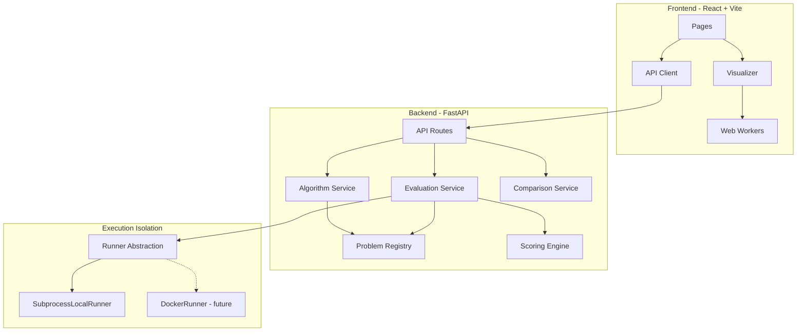

# CodeTrace Architecture

CodeTrace is a full-stack learning tool for algorithm visualization, comparison, and Python solution evaluation. It runs entirely locally with no AI API or paid service.

## Goals

- Visualize classic algorithms via structured events
- Compare algorithms on the same input with metrics and charts
- Evaluate student Python solutions with real tests and scoring
- Keep algorithm logic decoupled from UI
- Isolate untrusted code outside the API process

## High-level diagram

## Backend packages

| Package | Responsibility |
|---------|----------------|
| `algorithms/` | Pure algorithm implementations that emit event sequences |
| `events/` | Event schemas, validation, and replay helpers |
| `problems/` | Problem definitions (tests, signatures, constraints) |
| `runners/` | `Runner` ABC + subprocess local runner |
| `scoring/` | Correctness / edge-case / performance / overall scores |
| `schemas/` | Pydantic request/response models |
| `services/` | Orchestration used by API and CLI |
| `api/` | FastAPI routers |
| `cli/` | `codetrace` command entry points |

## Frontend layout

| Area | Responsibility |
|------|----------------|
| `algorithms/` | Thin client wrappers / metadata (complexity, explanations) |
| `visualizers/` | Event-driven renderers (array, graph) |
| `workers/` | Generate events / run comparisons off the main thread |
| `pages/` | Home, library, visualizer, compare, problems, submit, results, about |
| `hooks/` | Playback controls (play, pause, step, speed, reset) |

## Data flow: visualization

1. User chooses algorithm + input (custom, random, sorted, reverse).
2. Frontend requests steps from the backend **or** generates them in a Web Worker using shared TypeScript ports / API.
3. Algorithm returns `{ events, metrics, result }`.
4. Visualizer replays events; UI never embeds sort/search logic.

## Data flow: evaluation

1. User pastes/uploads a solution and selects a problem.
2. API writes solution into a temp dir and calls `Runner.run(...)`.
3. Runner starts a **separate Python process** (never `exec` in-process).
4. Harness imports the solution, runs visible + hidden tests, captures stdout/stderr.
5. Scoring computes weighted scores from real results.
6. Response shows passes/fails for visible tests only; hidden inputs stay secret.

## Security posture

- Default config does **not** expose public arbitrary-code execution beyond the intentional evaluate endpoint for local/dev use.
- Subprocess isolation is **not** a complete sandbox. See `RUNNER_SECURITY.md`.
- Docker-based runners can implement the same `Runner` interface later.

## Local-first design

- No external AI keys required
- Algorithms and problems ship with the repo
- Docker Compose starts frontend + backend for one-command demos
