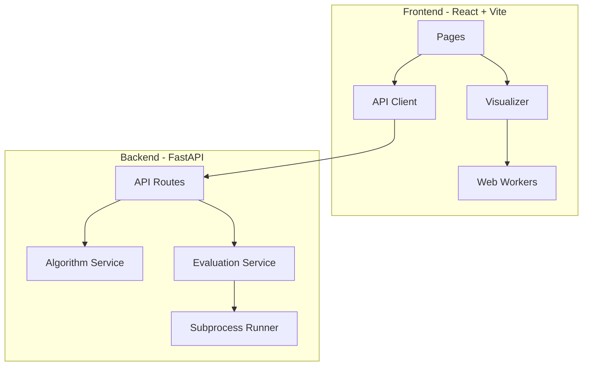

# CodeTrace

**See algorithms move — then test your own Python.**

CodeTrace is an open-source full-stack learning tool for algorithm visualization, comparison, and local Python solution evaluation. It runs entirely on your machine with **no AI API** and **no paid service**.

## Screenshots

> Add screenshots under `docs/screenshots/` after running locally:
>
> - `docs/screenshots/visualizer.png` — step-through bubble sort
> - `docs/screenshots/compare.png` — comparison chart
> - `docs/screenshots/evaluate.png` — scoring result

| Visualizer | Compare | Evaluate |
|------------|---------|----------|
| *(add image)* | *(add image)* | *(add image)* |

## Architecture



See [ARCHITECTURE.md](ARCHITECTURE.md) for details.

## Local setup

### Prerequisites

- Python 3.12+
- Node.js 20+
- Optional: Docker & Docker Compose

### Backend

```bash
cd backend
python -m venv .venv
# Windows: .venv\Scripts\activate
source .venv/bin/activate
pip install -e ".[dev]"
uvicorn codetrace.main:app --reload --port 8000
```

Health check: [http://127.0.0.1:8000/api/health](http://127.0.0.1:8000/api/health)

### Frontend

```bash
cd frontend
npm install
npm run dev
```

Open [http://127.0.0.1:5173](http://127.0.0.1:5173). Vite proxies `/api` to the backend.

### Docker Compose

```bash
cp .env.example .env
docker compose up --build
```

- Frontend: http://localhost:3000
- Backend: http://localhost:8000

## Example CLI commands

```bash
cd backend
pip install -e .

codetrace list
codetrace show binary-search
codetrace evaluate solution.py --problem binary-search
codetrace evaluate solution.py --problem binary-search --format json
```

Example `solution.py`:

```python
def binary_search(arr, target):
    low, high = 0, len(arr) - 1
    while low <= high:
        mid = (low + high) // 2
        if arr[mid] == target:
            return mid
        if arr[mid] < target:
            low = mid + 1
        else:
            high = mid - 1
    return -1
```

## Supported algorithms

| ID | Category |
|----|----------|
| `bubble-sort` | sorting |
| `insertion-sort` | sorting |
| `merge-sort` | sorting |
| `quick-sort` | sorting |
| `linear-search` | searching |
| `binary-search` | searching |
| `bfs` | graph |
| `dfs` | graph |
| `dijkstra` | graph |

## Supported evaluation problems

| ID | Function |
|----|----------|
| `binary-search` | `binary_search(arr, target)` |
| `merge-sort` | `merge_sort(arr)` |
| `two-sum` | `two_sum(nums, target)` |
| `bfs` | `bfs(graph, start)` |
| `dijkstra` | `dijkstra(graph, start)` |

## Testing commands

```bash
# Backend
cd backend
ruff check .
pytest

# Frontend
cd frontend
npm run lint
npm run typecheck
npm run build
```

## Known security limitations

- Student code is executed in a **subprocess**, never inside the FastAPI process.
- Subprocess isolation is **not** a complete security sandbox.
- Do **not** expose the evaluate endpoint to untrusted public internet traffic with the default runner.
- See [RUNNER_SECURITY.md](RUNNER_SECURITY.md).

## Documentation

- [ARCHITECTURE.md](ARCHITECTURE.md)
- [ALGORITHM_EVENTS.md](ALGORITHM_EVENTS.md)
- [PROBLEM_FORMAT.md](PROBLEM_FORMAT.md)
- [RUNNER_SECURITY.md](RUNNER_SECURITY.md)
- [ADDING_ALGORITHMS.md](ADDING_ALGORITHMS.md)
- [CONTRIBUTING.md](CONTRIBUTING.md)

## License

MIT — see [LICENSE](LICENSE).
